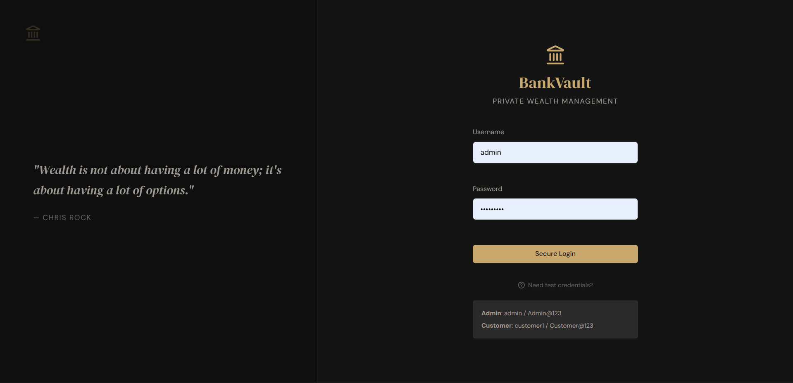
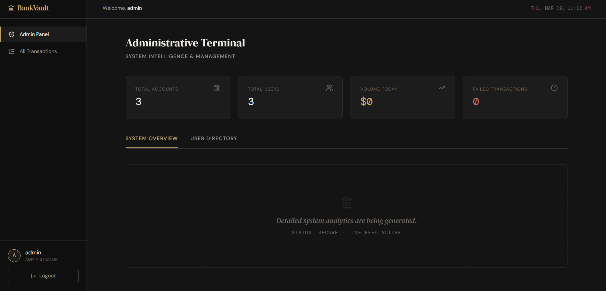
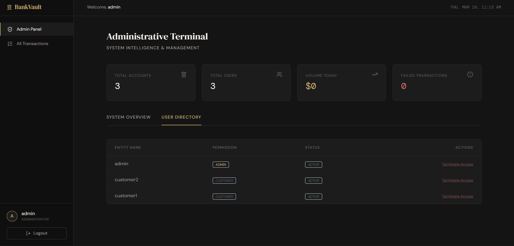
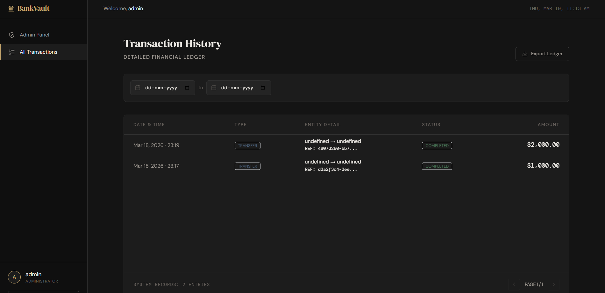
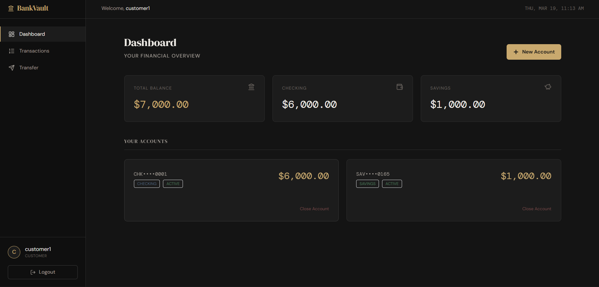
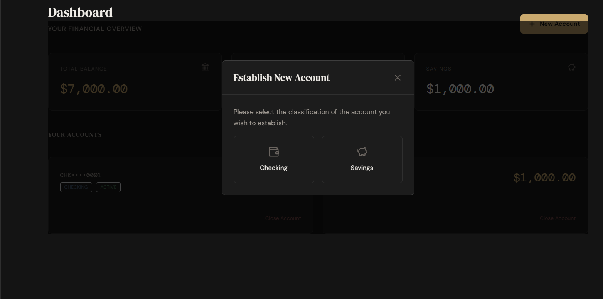
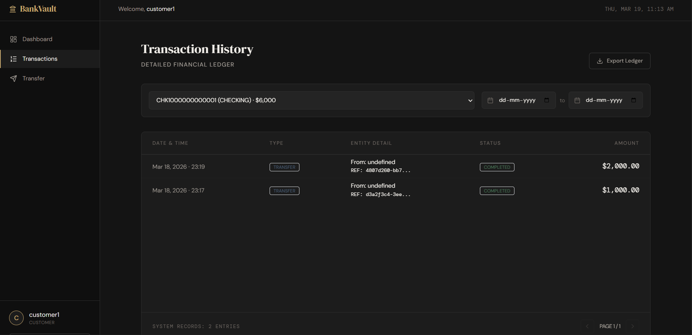
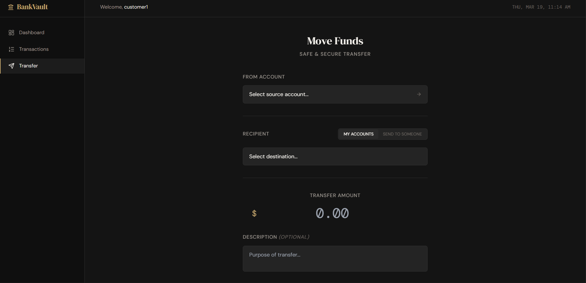

# 🏦 BankVault — Banking Transaction Management System

> Secure, full-stack banking platform with JWT authentication, role-based access control, fund transfers, and real-time transaction tracking.

---

## 📸 Screenshots

### Admin Login


### Admin Dashboard



### Admin Transaction View


### Customer Dashboard


### Customer Accounts


### Customer Transactions


### Transfer Funds


---

## ⚙️ Tech Stack

| Layer | Technology |
|---|---|
| Frontend | React 18, Tailwind CSS, Vite |
| Backend | Java 21, Spring Boot 3, Spring Security |
| Auth | JWT (RSA keypair), Refresh Token (HttpOnly Cookie) |
| Database | PostgreSQL 15, Flyway Migrations |
| DevOps | Docker, Docker Compose |
| Testing | JUnit 5, Vitest |

---

## 🏗️ Architecture

```
React Frontend (port 3000)
        │
        ▼  REST API + JWT
Spring Boot Backend (port 8080)
        │
        ▼
PostgreSQL (port 5432)
   └── Flyway auto-migrations on startup
```

---

## ✨ Features

**Authentication & Security**
- JWT access tokens + RSA keypair signing
- Refresh tokens stored in HttpOnly cookies
- Role-based access control (ADMIN / CUSTOMER)
- Secure logout with cookie invalidation

**Customer Features**
- View all personal accounts and balances
- Initiate fund transfers between accounts
- Paginated transaction history with filters
- Export transactions as CSV

**Admin Features**
- View all users and manage account status
- Full system-wide transaction visibility
- Dashboard with key system metrics
- Soft-delete / deactivate accounts

**Database**
- Flyway versioned migrations
- Auto-seeded with test credentials on startup

---

## 🚀 Setup

### Prerequisites
- Docker + Docker Compose

### Run

```bash
git clone https://github.com/yourusername/bankvault.git
cd bankvault
docker-compose up --build -d
```

One command. All services start automatically.

### Access

| Service | URL |
|---|---|
| Frontend | http://localhost:3000 |
| Backend API | http://localhost:8080 |
| PostgreSQL | localhost:5432 |

---

## 🔑 Test Credentials

| Role | Username | Password |
|---|---|---|
| Admin | `admin` | `Admin@123` |
| Customer | `customer1` | `Customer@123` |
| Customer | `customer2` | `Customer@123` |

---

## 📡 API Reference

### Auth
| Method | Path | Auth | Description |
|---|---|---|---|
| POST | `/api/auth/login` | No | Login — returns JWT + refresh cookie |
| POST | `/api/auth/refresh-token` | Cookie | Re-issue tokens |
| POST | `/api/auth/logout` | No | Clear refresh cookie |

### Accounts
| Method | Path | Auth | Description |
|---|---|---|---|
| GET | `/api/accounts/my` | CUSTOMER | Get my accounts |
| GET | `/api/accounts/{id}/balance` | CUSTOMER | Get account balance |
| DELETE | `/api/accounts/{id}` | ADMIN | Deactivate account |

### Transactions
| Method | Path | Auth | Description |
|---|---|---|---|
| POST | `/api/transactions/transfer` | CUSTOMER | Transfer funds |
| GET | `/api/transactions/account/{id}` | CUSTOMER | Transaction history |
| GET | `/api/transactions/account/{id}/export` | CUSTOMER | Export as CSV |

### Admin
| Method | Path | Auth | Description |
|---|---|---|---|
| GET | `/api/admin/users` | ADMIN | All users |
| PUT | `/api/admin/users/{id}/status` | ADMIN | Toggle user status |
| GET | `/api/admin/transactions` | ADMIN | All system transactions |
| GET | `/api/admin/dashboard/stats` | ADMIN | System metrics |

---

## 🔐 JWT Architecture

```
Login Request
     │
     ▼
Spring Security validates credentials
     │
     ▼
RSA private key signs JWT (access token, 15min)
     │
     ├──► JWT returned in response body
     └──► Refresh token set as HttpOnly cookie (7 days)

Subsequent requests:
Authorization: Bearer <jwt>

Token refresh:
POST /api/auth/refresh-token (cookie sent automatically)
```

---

## 🗃️ Database Schema

```sql
users         — id, username, email, password (bcrypt), role, active, created_at
accounts      — id, user_id, account_number, balance, type, active, created_at  
transactions  — id, from_account_id, to_account_id, amount, type, 
                description, timestamp
refresh_tokens — id, user_id, token, expiry, revoked
```

Managed by **Flyway** — migrations run automatically on startup:
- `V1__init.sql` — schema creation
- `V2__seed.sql` — test data seeding

---

## 🧪 Running Tests

**Backend:**
```bash
cd backend
mvn test
```

**Frontend:**
```bash
cd frontend
npm install
npm test
```

---

## 📝 Resume Bullets

```
• Built secure banking platform with JWT (RSA-signed) + HttpOnly refresh token rotation
• Implemented role-based access control with Spring Security (ADMIN / CUSTOMER roles)
• Designed fund transfer system with PostgreSQL transaction integrity
• Used Flyway for versioned database migrations with auto-seeding
• Built admin dashboard with full system-wide transaction visibility
• Implemented CSV export for transaction history
• Containerized full stack with Docker Compose for one-command deployment
```

---

## 📁 Project Structure

```
bankvault/
├── docker-compose.yml
├── backend/                     ← Spring Boot (Java 21)
│   ├── pom.xml
│   └── src/main/java/com/banking/
│       ├── config/              ← Security, JWT, CORS
│       ├── controller/          ← Auth, Accounts, Transactions, Admin
│       ├── service/             ← Business logic
│       ├── model/               ← User, Account, Transaction
│       ├── repository/          ← JPA repositories
│       └── resources/
│           └── db/migration/    ← Flyway SQL migrations
└── frontend/                    ← React 18 + Tailwind
    └── src/
        ├── pages/               ← Login, Dashboard, Transactions, Transfer
        ├── components/          ← Navbar, Tables, Cards
        └── api/                 ← Axios instance with JWT interceptor
```

---

*Built to demonstrate production-level banking application security and architecture.*
